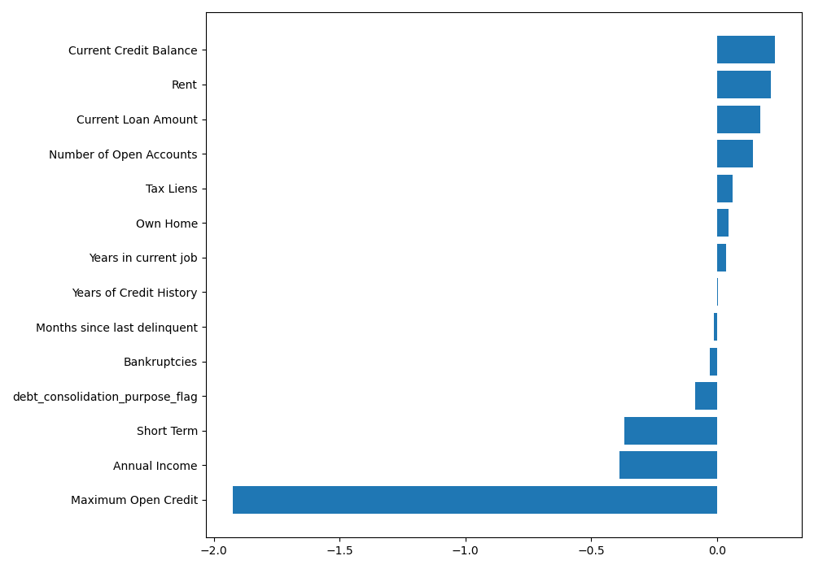

# Predicting loan defaults

## Modelling objective

Build a classifier to predict whether a customer will default on a loan

## Personal objectives

Create a modelling pipeline to gain experience in the following areas:
* EDA
* Creating data-cleaning pipeline
* Creating a predictive model
* Analysing feature importance

For this project I also tried to apply the principles of both modular and functional coding rather than
having one (or multiple) long and hard to read Jupyter notebooks. Instead, I only used notebooks for
the EDA, and used .py scripts for the data cleaning pipeline and modelling. 

## Modelling approach

### Imbalanced target class and metric optimisation:
As the target class is imbalaced accuracy wouldn't be a good measure; I instead decided that optimizing
precision or recall. Because we're looking at loan defaults, false positives would likely be better than 
false negatives (it's bad if we *miss* a customer who may default). Thus, I used used recall and the f-beta score
as the main metric to measure
* When training we'll need to stratify the target in the cross validation loop

### Model selection:
For this kind of classification models we could use include a Naive Bayes classifiear, 
logistic regression, random forest, support vector machines etc. Essentially we could
just iterated through all the binary classifers in Sci-kit Learn. However, I wanted to be more
intentional in my choice of classifier, so decided to go with ol' logistic regression: a linear model 
should make sense as we have relatively few features compared to the sample size (n > p), and it has 
the additional benefit of having easily interpretable coefficients. (However, in saying this, it's likely
that I experiments with other models)

## Notes on logistic regression:
* Starting with a linear model serves as a good benchmark, and has the advantage of interpretability
* We used need some regularisation so we don't overfit. Tunable hyperparameters:
    * regularisation method (l2, l1, elastic-net)
    * Strength of regularisation (C)
    * *After doing a cross validated grid search, l1 regularisation with C=1 gave the best results*
* In order for coefficients to be comparable, we need to scale the input data
* Another consideration is that logistic regression gives a probabilistic output,
  which for this use-case is probably a helpful output. For example, if communicating to stakeholders,
  or visualising this score in a dashboard, a probabilistic score is easy to interpret. Though we have a
  'model threshold' for predictions, a probabilistic score could also potentially be used for different
  courses of action for different thresholds. (Say, different types of intervention)

## Results (as of 2021-04-02)

Model results on test set:\
Recall: 0.44\
F-beta (F-2): 0.43

Currently, these model results don't seem hugely spectacular, but prediction scores will generally be lower.
In practice, the important thing would be whether these are actionable by stakeholders - say for example, taking 
intervention action early to more closely manage the customer relationship. In it's current state it means we could 
at least make proactive contact with close to half of customers who may default.

## Feature importance

Logistic regression coefficients aren't *exactly* the same as, say, the feature importance measure we
might get from something like SHAP values. However, as we scaled them (transformed in z-scores) for the model inputs,
it allows us to get an idea of which coefficients tend to have larger effect sizes on the predicted probability.

Our classifier gives the following coefficient/feature importances:\

(Note: this comparison is to look at the relative differences between features not a concrete measure of *an increase of x in
feature k causes an increase of y in the target variable*. Essentially what we have here is the effect of a features *z-score* on
the log-odds of the target variable)

## Next steps (in no particular order)
1. Currently the engineering pipeline is essentially data cleaning. Could:
    a. Do some feature engineering (computed on current features e.g. interactions, ratio etc.)
    b. Feature transformations (e.g. log transform right skewed features, apply polynomial function etc.)
    c. Test assumptions 
2. Look at model scoring variance (how stable are scores are different folds in cross validation)
3. Look at features with 'high' importance/effect size - test effects of feature engineering, transformation, or removing them 
4. Try different models
